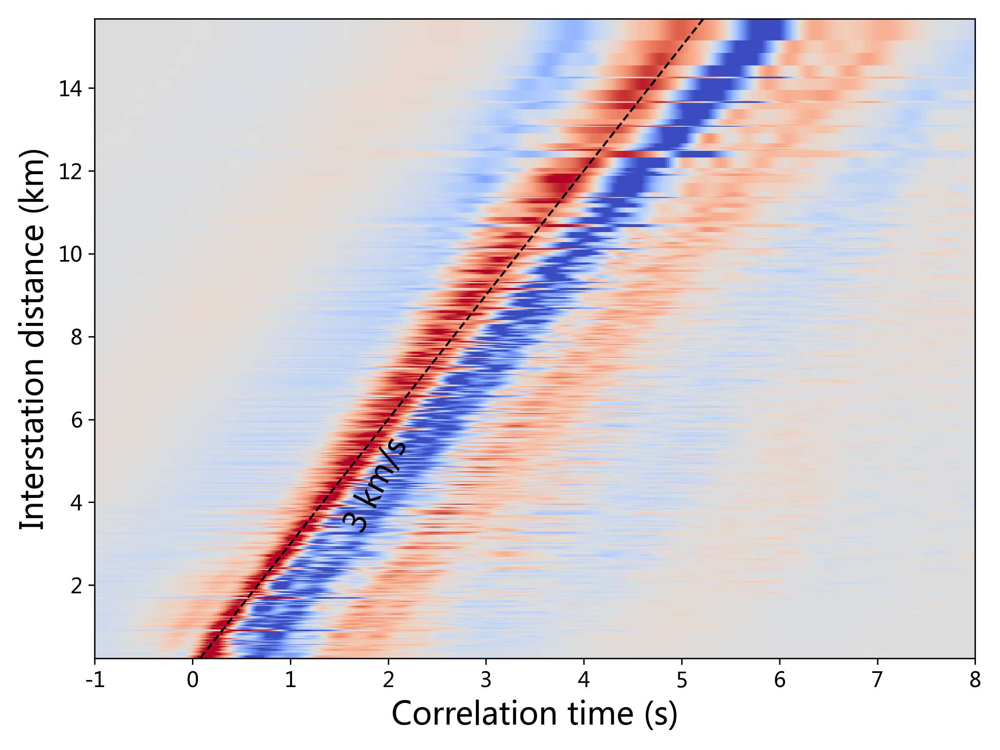
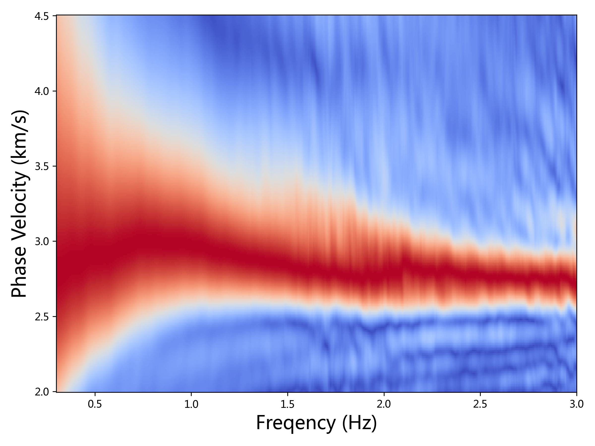

# MASW

Obtain the array average phase velocity from seismic ambient noise cross-correlations (ANCs) using multichannel analysis of surface waves (MASW; Park et al., 1999).

## Project layout
- `masw/`: reusable package containing configuration models, preprocessing, MASW computation, plotting, and pipeline helpers.
- `masw.py`: CLI entry point that forwards to `masw/cli.py`.
- `Data_CCFs/`: expected location of SAC inputs.
- `All_sacdata_ZZ.pickle`, `MASW_raw_data.npz`: caches created during preprocessing and dispersion computation.

## Quickstart
Install dependencies, ideally in a virtual environment:

```bash
pip install -r requirements.txt
```

Ensure `Data_CCFs/` contains your SAC files, then run:

```bash
python masw.py plot
```

The command will preprocess inputs, compute dispersion, and save the default figures `Figure1_wavefield.png` and `Figure2_masw_avg_dispersion.png`.

### Example outputs





## CLI usage
Three subcommands are available:

- **prepare**: preprocess and cache SAC files.
  ```bash
  python masw.py prepare --data-dir Data_CCFs --waveform-cache All_sacdata_ZZ.pickle
  ```
- **masw**: compute MASW energy without plotting (useful for batch runs).
  ```bash
  python masw.py masw --min-distance 0.8 --zero-padding 6
  ```
- **plot**: full pipeline with figures (default).
  ```bash
  python masw.py plot --wavefield-figure Figure1_wavefield.png --dispersion-figure Figure2_masw_avg_dispersion.png
  ```

Common options:
- `--bandpass-low` / `--bandpass-high`: bandpass frequencies (Hz).
- `--taper-vmin` / `--taper-vmax`: velocity bounds (km/s) for time windowing.
- `--min-distance`: minimum station spacing included in averaging (km).
- `--zero-padding`: zero padding factor for MASW FFT grid.
- `--no-cache`: force recomputation instead of reusing cached waveforms.

## Reusing the API
For notebook or scripted workflows, import the pipeline helpers:

```python
from masw import (
    PathConfig,
    PreprocessConfig,
    MASWConfig,
    AveragingConfig,
    prepare_wavefield,
    run_pipeline,
)

wavefield, distances, times, fs = prepare_wavefield(PathConfig(), PreprocessConfig())
velocities, freqs, energy = run_pipeline()
```

Adjust the configuration objects to match new datasets (e.g., data directory, bandpass, velocity grid) without editing the internal code.

## References

Park, C. B., Miller, R. D., & Xia, J. (1999). Multichannel analysis of surface waves. Geophysics, 64(3), 800–808. https://doi.org/10.1190/1.1444590
